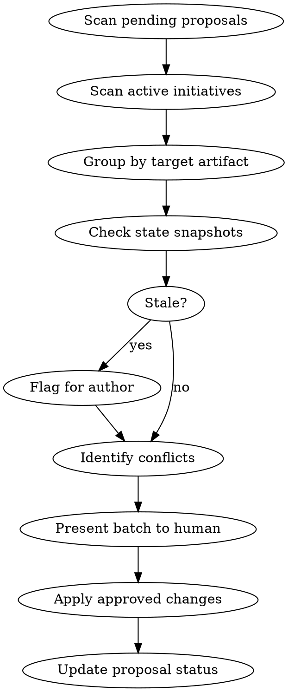

# Integration Review

## Overview

Batch review and integrate pending initiative proposals into shared artifacts. This is Layer 3 of the parallel workflow governance system — the step where proposals become real changes.

**Core principle:** Never apply proposals individually. Always scan the full queue, group by target, resolve conflicts, then apply as a batch.

## When to Use

- Multiple initiatives have submitted proposals to `docs/initiatives/`
- Starting a periodic review session (daily or weekly)
- A specific initiative's proposal needs review before planning begins
- After a research batch completes

## The Review Protocol



### Step 1: Scan

```bash
# Find all pending proposals
grep -r "status: pending" docs/initiatives/*/proposal.md

# Check active initiatives (those with activity logs)
find docs/initiatives -name activity.md
```

Read each pending proposal fully. Note its targets, type, and risk level.

### Step 2: Group by Target

Organize proposals by which shared artifact they want to modify:

| Target | Proposals | Risk |
|--------|-----------|------|
| `docs/roadmap.md` | vedic-astrology, platform-api | evolutionary |
| `docs/ux/voice-and-tone.md` | content-evolution | evolutionary |
| `.claude/rules/new-rule.md` | new-skill-proposal | additive |

**Additive proposals** (new files, new sections) can often be batch-approved.
**Evolutionary proposals** (modifying existing content) need individual review.
**Structural proposals** (changing how things work) need careful analysis.

### Step 3: Check Freshness

For each proposal, compare its **State Snapshot** section against current reality:
- Has the target artifact changed since the proposal was written?
- Have other proposals already been integrated that affect this area?
- Are the assumptions still valid?

Flag stale proposals. They may need the author to refresh.

### Step 4: Identify Conflicts

Look for proposals that:
- Want contradictory changes to the same artifact
- Make incompatible assumptions
- Would create inconsistency if both were applied

Present conflicts explicitly: "Proposal A wants X, Proposal B wants Y. These conflict because Z."

### Step 5: Present to Human

For each group, show:
1. Which proposals are in the group
2. What changes they propose (exact content)
3. Any staleness flags
4. Any conflicts with recommended resolution
5. Your recommendation: approve / decline / defer / request refresh

Use AskUserQuestion for approval decisions. Group additive/low-risk proposals together for batch approval.

### Step 6: Apply

For approved proposals:
1. Make the actual edits to shared artifacts
2. Update `proposal.md` frontmatter: `status: approved` (or `integrated` if changes are complete)
3. Update the `updated` date

For declined proposals:
1. Update `proposal.md` frontmatter: `status: declined`
2. Add a `## Decision` section with the reason

### Step 7: Verify

After applying all changes, read each modified shared artifact to confirm consistency. Check that:
- No contradictions were introduced
- Formatting is consistent
- Cross-references are valid

## Quick Reference

| Proposal Risk | Review Approach | Batch OK? |
|--------------|-----------------|-----------|
| additive | Scan for duplicates, approve | Yes |
| evolutionary | Review exact changes, check freshness | Group by target |
| structural | Full analysis, conflict check | No — individual review |

## Studio Approval (Individual)

For individual proposal approval, use the Studio UI at `/app/studio/process`:
1. Click the initiative in the Process list
2. When lifecycle shows "Needs Review", Approve/Decline buttons appear
3. Approval triggers post-automation (activity log creation, plan scaffolding via LM Studio if available)

The batch review protocol above is for reviewing multiple proposals at once or when Studio is unavailable.

## Common Mistakes

- **Applying proposals one at a time.** Always review the full queue first. Two proposals may affect the same target.
- **Skipping the state snapshot check.** A proposal written 3 days ago may be based on outdated assumptions.
- **Approving without reading the target artifact.** Read what exists BEFORE applying the proposed change.
- **Forgetting to update proposal status.** Leaves the queue dirty for the next review session.
