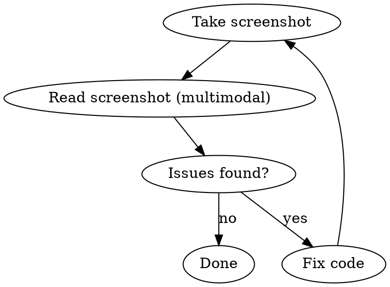

# UI Review

Visual verification loop using Playwright screenshots. Take screenshots, review them (multimodal), fix issues, re-screenshot until the UI is right.

## Setup

Playwright is installed at the monorepo root. Chromium is the test browser.

```bash
pnpm exec playwright install chromium   # first-time browser install
```

## Two Modes

### Verify (ad-hoc)

Screenshot a specific route after making changes:

```bash
# Screenshot the home page (desktop)
pnpm exec playwright test e2e/verify.spec.ts --project desktop

# Screenshot a specific route
VERIFY_ROUTE=/skills pnpm exec playwright test e2e/verify.spec.ts --project desktop

# Custom output path
VERIFY_ROUTE=/tasks VERIFY_OUT=.screenshots/tasks-new.png pnpm exec playwright test e2e/verify.spec.ts --project desktop

# Mobile viewport
VERIFY_ROUTE=/workforce pnpm exec playwright test e2e/verify.spec.ts --project mobile
```

Screenshots land in `.screenshots/` (gitignored).

### Sweep (systematic)

Screenshot all Studio routes at all viewports — for PR documentation or full visual audit:

```bash
pnpm exec playwright test e2e/sweep.spec.ts
```

Creates a timestamped directory: `.screenshots/sweep-YYYY-MM-DDTHH-MM/` with `{viewport}-{route}.png` for every route in `e2e/routes.json`.

**Route manifest:** `e2e/routes.json` defines routes and viewports. Update it when adding new pages.

## The Review Loop



1. **Screenshot:** Run verify for the route you changed
2. **Review:** Use the Read tool on the `.png` — you can see the rendered UI
3. **Evaluate:** Check layout, spacing, alignment, text overflow, responsive behavior
4. **Fix:** Edit components based on what you see
5. **Re-screenshot:** Repeat until satisfied

## PR Screenshots

Before creating a PR with frontend changes:

1. Run sweep (or verify for changed routes)
2. Reference screenshot paths in the PR body:
   ```markdown
   ## Screenshots
   Desktop: `.screenshots/verify-tasks.png`
   Mobile: `.screenshots/verify-tasks-mobile.png`
   ```
3. The user reviews screenshots from the PR

## What to Look For

- Layout shifts or overflow at both viewports
- Missing or misaligned content
- Empty states rendering correctly
- Navigation and sidebar state
- Typography hierarchy and spacing
- Dark/light mode if applicable

## Common Pitfalls

- **Server not running:** Config has `reuseExistingServer: true`. Either start `pnpm dev:studio` first, or let Playwright start it (slower on first run).
- **Dynamic routes:** Sweep only covers static routes in the manifest. For dynamic pages (`/skills/[slug]`), use verify with a known slug.
- **networkidle timeout:** Some pages with streaming/polling may not reach networkidle. Use `domcontentloaded` if stuck:
  ```bash
  VERIFY_WAIT=domcontentloaded VERIFY_ROUTE=/sessions pnpm exec playwright test e2e/verify.spec.ts
  ```
